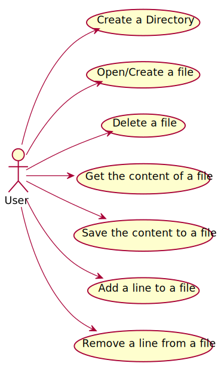

# Use Cases Diagram

# Use cases
**Note:** Every use case will be written in portuguese.

|UC Number|Name|
|:--------|:---|
|UC1|[Create a directory](UC1.md)|
|UC2|[Open/Create a file](UC2.md)|
|UC3|[Delete a file](UC3.md)|
|UC4|[Get the content of the file](UC4.md)|
|UC5|[Save file content](UC5.md)|
|UC6|[Add a line to a file](UC6.md)|
|UC7|[Remove a line from a file](UC7.md)|

