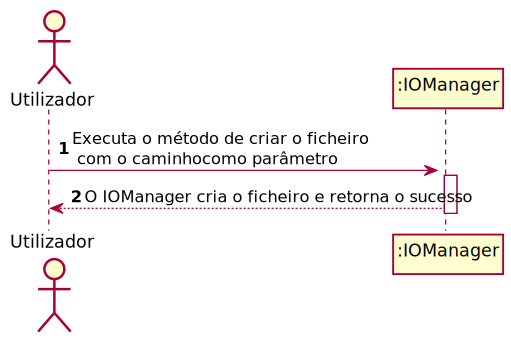
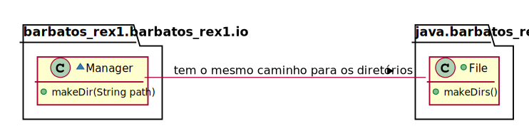
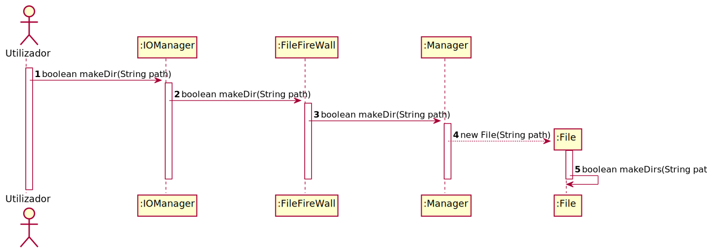

# UC1 - Criar uma pasta/diretório

## 1.Engenharia de Requisitos.
### Formato breve

O utilizador seleciona o método que cria o diretório, especifica o caminho para 
o mesmo e a pasta é criado.

### SSD

### Formato Completo

#### Ator Principal
O Utilizador

#### Partes interessadas e seus interesses.

**Utilizador:** pretende criar uma pasta.

#### Pré-condições

\-

#### Pós-condições

O diretório é criado com sucesso.

#### Cenário de sucesso principal (ou fluxo básico)

1. O Utilizador executa o método fornecendo o caminho para o ficheiro como parâmetro. 
2. O IOManager cria o diretório e retorna o sucesso da operação. 

#### Extensões (ou fluxos alternativos)

\-

#### Requisitos especiais

\-

#### Lista de Variações de Tecnologias e Dados

\-

#### Frequência de Ocorrência

\-

## 2. Análise OO

### Excerto do Modelo de Domínio Relevante para o UC

## 3. Design - Realização do Caso de Uso

### Racional

| Fluxo Principal | Questão: Que Classe... | Resposta  | Justificação  |
|:--------------  |:---------------------- |:----------|:---------------------------- |
| 1. O Utilizador executa o método fornecendo o caminho para o ficheiro como parâmetro. |...interage com o utilizador?| IOManager|Pure Fabrication|
| |...cordena o caso de uso| FileFireWall|Controller
| 2. O IOManager cria o diretório e retorna o sucesso da operação.|...cria a pasta?|Manager| Information Expert pois é o responsável por gerir o ficheiro|

### Sistematização ##

Do racional resulta que as classes conceptuais promovidas a classes de software são:

* Manager

Outras classes de software (i.e. Pure Fabrication) identificadas:  

* IOManger
* FileFireWall

###	Diagrama de Sequência

###	Diagrama de Classes

 

