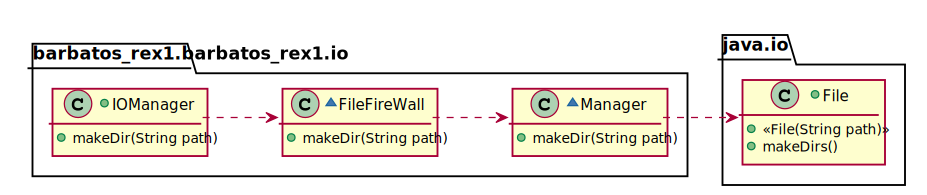

# UC2 - Abrir/Criar um ficheiro

## 1.Engenharia de Requisitos.
### Formato breve

O utilizador instancia uma classe. Essa classe pede uma string ou um ficheiro como parâmetro.
Após isso, o ficheiro é aberto/criado.

### SSD

### Formato Completo

#### Ator Principal
O Utilizador

#### Partes interessadas e seus interesses.

**Utilizador:** pretende abrir/criar um ficheiro.

#### Pré-condições

\-

#### Pós-condições

O ficheiro é criado/aberto com sucesso.

#### Cenário de sucesso principal (ou fluxo básico)

1. O Utilizador executa o método fornecendo o caminho para o ficheiro ou o ficheiro como parâmetro. 
2. O Manager cria/abre o ficheiro e retorna o sucesso da operação. 

#### Extensões (ou fluxos alternativos)

\-

#### Requisitos especiais

\-

#### Lista de Variações de Tecnologias e Dados

\-

#### Frequência de Ocorrência
(descrever com que frequência este UC é realizado)

\-

## 2. Análise OO

### Excerto do Modelo de Domínio Relevante para o UC

## 3. Design - Realização do Caso de Uso

### Racional

| Fluxo Principal | Questão: Que Classe... | Resposta  | Justificação  |
|:--------------  |:---------------------- |:----------|:---------------------------- |
| 1. O Utilizador executa o método fornecendo o caminho para o ficheiro ou o ficheiro como parâmetro. |...interage com o utilizador?| IOManager|Pure Fabrication|
| |...cordena o caso de uso| FileFireWall|Controller
| 2. O Manager cria/abre o ficheiro e retorna o sucesso da operação.|...cria/abre o ficheiro?|Manager| Creator(Regra 2)|
| |...importa o conteúdo do ficheiro(quando aberto)?| Importer|Information Expert

### Sistematização ##

 Do racional resulta que as classes conceptuais promovidas a classes de software são:

* Manager
* Importer

Outras classes de software (i.e. Pure Fabrication) identificadas:  

* IOManger
* FileFireWall

###	Diagrama de Sequência

###	Diagrama de Classes

 

