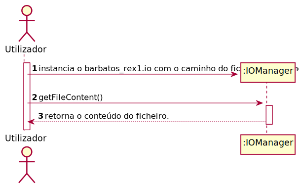
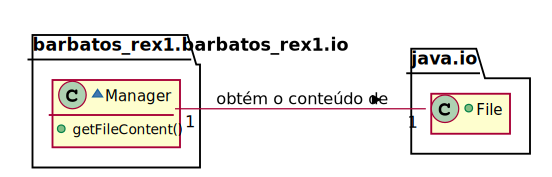
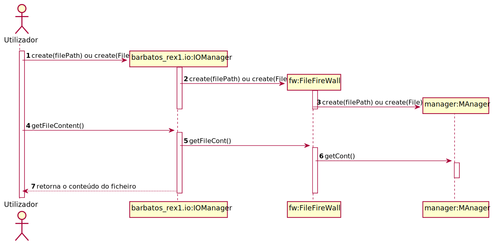

#UC4 - Obter o conteúdo do ficheiro.
## 1.Engenharia de Requisitos.
### Formato breve

O utilizador declara um método que obtém o conteúdo do ficheiro. O método retorna o conteúdo.

### SSD

### Formato Completo

#### Ator Principal
O Utilizador

#### Partes interessadas e seus interesses.

**Utilizador:** pretende armazenar o conteúdo do ficheiro.

#### Pré-condições

\-

#### Pós-condições

O conteúdo do ficheiro é recebido com sucesso.

#### Cenário de sucesso principal (ou fluxo básico)

1. O Utilizador instancia IOManager.
2. O Utilizador chama o método getFileContent().
3. O IOManager retorna o conteúdo do ficheiro. 

#### Extensões (ou fluxos alternativos)

\-

#### Requisitos especiais

\-

#### Lista de Variações de Tecnologias e Dados

\-

#### Frequência de Ocorrência

\-

## 2. Análise OO

### Excerto do Modelo de Domínio Relevante para o UC

## 3. Design - Realização do Caso de Uso

### Racional

| Fluxo Principal | Questão: Que Classe... | Resposta  | Justificação  |
|:--------------  |:---------------------- |:----------|:---------------------------- |
| 1. O Utilizador instancia IOManager. |...interage com o utilizador?| IOManager|Pure Fabrication|
| |...cordena o caso de uso| FileFireWall|Controller
| 2. O Utilizador chama o método getFileContent().
| 3. O IOManager retorna o conteúdo do ficheiro.|...tem o conteúdo do ficheiro?|Manager| Information Expert (Regra 1)|

### Sistematização ##

 Do racional resulta que as classes conceptuais promovidas a classes de software são:

* Manager

Outras classes de software (i.e. Pure Fabrication) identificadas:  

* IOManger
* FileFireWall

###	Diagrama de Sequência

###	Diagrama de Classes

*O diagrama de classes foi omitido pelo simples motivo de ser possível ler o código e o mesmo ser pouco complexo*

<!--
