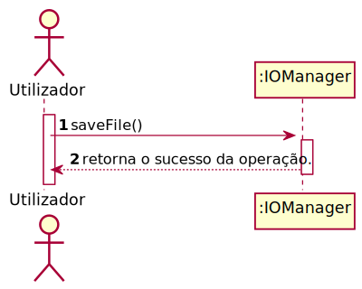
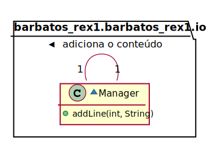
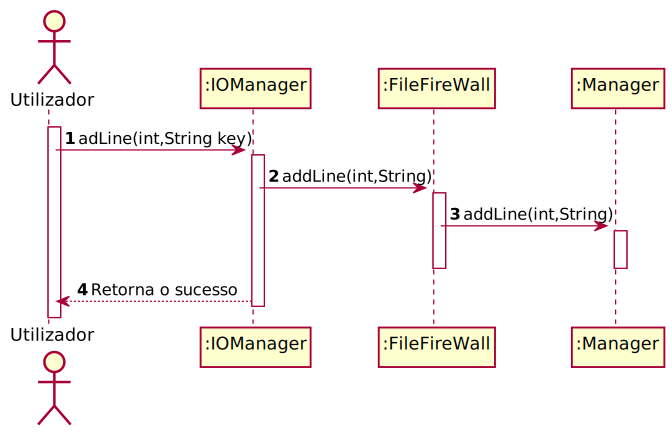

# UC6 - Adicionar uma linha a um ficheiro

## 1.Engenharia de Requisitos.
### Formato breve

O utilizador chama um método de uma classe. O sistema adiciona a linha ao ficheiro e retorna o sucesso da operação.

### SSD

### Formato Completo

#### Ator Principal
O Utilizador

#### Partes interessadas e seus interesses.

**Utilizador:** pretende adicionar conteúdo ao ficheiro.

#### Pré-condições

Uma instância de IOManager

#### Pós-condições

A linha é adicionada ao conteúdo, mas não gravada.

#### Cenário de sucesso principal (ou fluxo básico)

1. O Utilizador executa o método addLine(int index, String conteúdo, Key). 
2. O IOManager adiciona a linha o conteúdo. 

#### Extensões (ou fluxos alternativos)

\-

#### Requisitos especiais

\-

#### Lista de Variações de Tecnologias e Dados

\-

#### Frequência de Ocorrência

\-

## 2. Análise OO

### Excerto do Modelo de Domínio Relevante para o UC

## 3. Design - Realização do Caso de Uso

### Racional

| Fluxo Principal | Questão: Que Classe... | Resposta  | Justificação  |
|:--------------  |:---------------------- |:----------|:---------------------------- |
| 1. O Utilizador executa o método addLine(int index, String conteúdo, Key).  |...interage com o utilizador?| IOManager|Pure Fabrication|
| |...cordena o caso de uso| FileFireWall|Controller
| 2. O IOManager adiciona a linha o conteúdo. |...adiciona a linha ao conteúdo?|Manager| Information Expert pois é o responsável por exportar conteúdo para o ficheiro|

### Sistematização ##

Do racional resulta que as classes conceptuais promovidas a classes de software são:

* Manager

Outras classes de software (i.e. Pure Fabrication) identificadas:  

* IOManger
* FileFireWall

###	Diagrama de Sequência

###	Diagrama de Classes

*O diagrama de classes foi omitido pelo simples motivo de ser possível ler o código e o mesmo ser pouco complexo*
 

